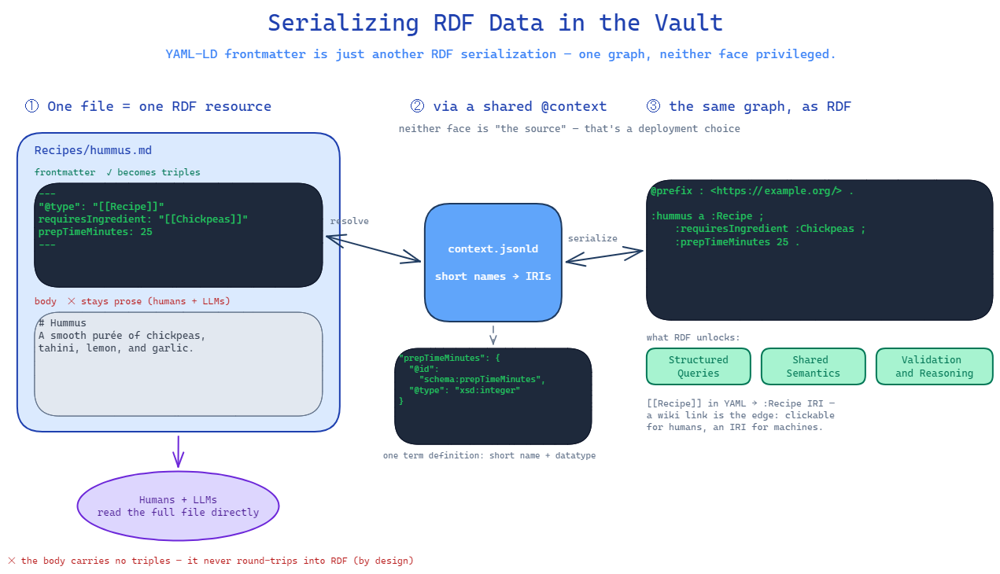

# Vault-LD Specification - Linked Data in the Vault

*An open format for knowledge two very different readers can share at once: a person editing notes, and a machine reasoning over a graph.*

> For the motivation behind Vault-LD and a worked example, see the [README](README.md). This document is the normative reference.

## 1. Overview

Vault-LD treats a directory of Markdown notes as an RDF graph: each note's YAML frontmatter, read as [YAML-LD](https://json-ld.github.io/yaml-ld/spec/) (JSON-LD with a YAML serialization) through one shared context, becomes that note's triples. Because the frontmatter is YAML-LD, a note and an ontology definition are the *same kind of object*, and either can be projected losslessly to RDF and back. An ontology can enter as Turtle, be edited as Markdown, and leave as Turtle again, or the reverse, with no canonical "real" form privileged over the other.



This document specifies that roundtrip in two inverse halves. **§4, frontmatter as a knowledge graph,** shows how the YAML at the top of a note becomes RDF triples linked to ontologies and vocabularies. **§5, the RDF ⇄ vault-format roundtrip,** shows how any RDF graph is projected into this directory-of-files shape and exported back out with full fidelity. The remaining sections fix terminology (§2), show the directory structure at a glance (§3), list the conformance criteria (§6), and relate the format to existing standards (§7).

## 2. Terminology

The key words **MUST**, **MUST NOT**, **SHOULD**, and **MAY** are used in the sense of [RFC 2119](https://www.rfc-editor.org/rfc/rfc2119).

- **Vault**: the directory of Markdown files, opened as a knowledge base by a host tool (Obsidian, Notion, or any editor).
- **Note / file**: one Markdown document. In linked-data terms it is one RDF *resource* (one subject).
- **Frontmatter**: the YAML block delimited by `---` at the top of a note. Read as YAML-LD, it is the note's triples.
- **Context**: the shared JSON-LD `@context` that maps short field names and prefixes to IRIs for the whole vault. It is conventionally rooted in `context.jsonld`, but **MAY** be composed of several documents: a context value that is an *array* pulls in further context documents by reference (JSON-LD composition), so each ontology can ship its own self-contained context (§4.2).
- **Vault format**: the resource-per-file representation, namely frontmatter triples (one subject per file) plus a documentation body.
- **Schema layer / instance layer**: definitions (classes, properties, concepts) versus the typed notes that conform to them.
- **Source of truth**: the serialization a given deployment designates as authoritative for an asset (Markdown, Turtle, or another). This is a per-asset, per-deployment choice, not fixed by this format.
- **Generated artifact**: whichever serialization a deployment derives from the source of truth (e.g. a `.ttl` exported from Markdown, or Markdown generated from a hand-maintained `.ttl`). It is treated as read-only *in that deployment*, in whichever direction generation runs.

## 3. Structure at a Glance

A vault is a tree of Markdown files plus a composed context (a root document and one per ontology/vocabulary):

```
context.jsonld                     # the root @context - composes the contexts below
Ontologies/
  Culinary/
    context.jsonld                 # Culinary's own namespace (@base) + term definitions
    Culinary.md                    # the ontology resource (owl:Ontology)
    Classes/
      Recipe.md                    # owl:Class - subClassOf declared in frontmatter
      CreativeWork.md
      Ingredient.md
    Properties/
      requiresIngredient.md        # owl:ObjectProperty
      prepTimeMinutes.md           # owl:DatatypeProperty
Vocabularies/
  DifficultyLevels/
    context.jsonld                 # the vocabulary's own namespace (@base)
    DifficultyLevels.md            # skos:ConceptScheme
    Beginner.md                    # skos:Concept - topConceptOf declared in frontmatter
    NoCook.md                      # skos:Concept - broader: [[Beginner]] (concept-to-concept)
Recipes/
  hummus.md                        # an instance: "@type": "[[Recipe]]"
```

The root `context.jsonld` carries the cross-cutting core (shared prefixes, the data `@base`, and the structural RDFS/OWL/SKOS terms) and *composes* each ontology's and vocabulary's own context by reference. Every ontology or vocabulary ships a `context.jsonld` beside its notes that declares its own namespace (`@base`) and any domain terms it coins (§4.2); a vocabulary whose predicates are all generic SKOS may declare only its `@base`. The `Classes/` and `Properties/` folders are **flat**: they group resources by kind, not by hierarchy. A class's place in the `subClassOf` tree (and a concept's place in the `broader`/`narrower` tree) is declared in its frontmatter, not in its folder path. Folders are an organisational convenience and carry no formal meaning.

There is nothing else to install. The directory *is* the knowledge base, and it is self-describing: every name a file uses resolves through the composed context, which travels with the vault.

## 4. Frontmatter as a Knowledge Graph

### 4.1 The note is the subject

Each file is one RDF resource. Its frontmatter key/value pairs are predicate/object pairs about that resource; the body is documentation for human and machine readers that is deliberately **not** part of the triple set (§5.3). Read this note:

```markdown
---
"@type": "[[Recipe]]"
requiresIngredient: "[[Chickpeas]]"
prepTimeMinutes: 25
---

# Hummus
A smooth purée of chickpeas, tahini, lemon, and garlic.
```

You have just read these triples:

```turtle
<this-file> a :Recipe ;
            :requiresIngredient <Chickpeas> ;
            :prepTimeMinutes 25 .
```

### 4.2 The context is shared and external, by design

A note **MUST NOT** carry its own `@context` block. The context lives *outside* the notes, and is the single source of truth for:

- the **base namespace** (e.g. `https://example.org/`),
- **prefix → namespace** mappings (`owl:`, `rdfs:`, `skos:`, `dcterms:`, `sdo:` for schema.org, and the local `ex:`),
- **term definitions**: short frontmatter field names mapped to full IRIs, with datatype or IRI coercion.

So `prepTimeMinutes: 25` can be typed as `xsd:integer`, and `subClassOf` can be coerced to an IRI reference, *without* the author writing any of that. Authors write short, clean names; the context supplies the semantics. A name not present in the context is not part of the shared vocabulary; to make it first-class, add it to the context.

This externalization is intentional: the model is defined outside the notes, every file stays terse, and the vault remains diffable and human-scannable.

**The context MAY be composed of several documents.** Following JSON-LD's own mechanism, a context value that is an *array* applies its entries left-to-right, with later entries overriding earlier ones, and a string entry is a *reference* to another context document resolved relative to the document that names it. This lets the root `context.jsonld` hold the cross-cutting core — prefixes, `@base`, and the structural terms (`label`, `subClassOf`, `domain`, `broader`, …) — and then pull in each ontology's own self-contained context, exactly as a published ontology ships a `context.jsonld` defining its terms:

```json
{
  "@context": [
    { "@base": "https://example.org/", "owl": "…", "label": "rdfs:label", "subClassOf": { "@id": "rdfs:subClassOf", "@type": "@id" } },
    "Ontologies/Culinary/context.jsonld",
    "Vocabularies/DifficultyLevels/context.jsonld"
  ]
}
```

Each referenced ontology context also declares the **`@base` for its own namespace** — the scoped base its members are minted under (§4.5, §5.4):

```json
{ "@context": { "@base": "https://example.org/culinary#", "cul": "https://example.org/culinary#",
                "requiresIngredient": { "@id": "cul:requiresIngredient", "@type": "@id" } } }
```

Composition is transparent to authors: every short name still resolves through one effective context, whichever file physically defines it. The benefit is modularity — an ontology owns its vocabulary *and its namespace*, the root merely lists the ontologies it composes — without giving any note a local `@context`.

> **Deviation from JSON-LD 1.1 context processing.** A standard JSON-LD processor *ignores* `@base` in an externally referenced context; only the root document's `@base` would ever apply. Vault-LD deliberately departs from this in one respect: a conforming tool reads each referenced ontology/vocabulary context **in isolation** and uses its `@base` as the *scoped base* under which that ontology's own members are minted (§4.5, §5.4). Term and prefix definitions compose exactly as JSON-LD specifies (left-to-right, later entries overriding earlier ones), and a referenced context's `@base` never overrides the root's for anything outside its own folder. The consequence: a generic JSON-LD processor given the composed context resolves every *term* identically, but subject IRIs are minted by the rules of this specification, not by JSON-LD relative-IRI resolution.

When composing contexts, a tool **SHOULD** warn if a later context redefines a term or prefix an earlier one already defined: JSON-LD's override semantics make the shadowing legal, but across independently authored ontologies it is almost always an accidental name collision, and it is silent by default.

### 4.3 The field-naming contract

| Concern                       | Rule                        | Example                                        |
| ----------------------------- | --------------------------- | ---------------------------------------------- |
| Type declaration              | wiki link to the class      | `"@type": "[[Recipe]]"`                        |
| Object property (→ resource)  | wiki link                   | `requiresIngredient: "[[Chickpeas]]"`          |
| Datatype property (→ literal) | plain scalar                | `prepTimeMinutes: 25`, `published: 2026-06-17` |
| External-vocabulary term (in a **value**) | prefixed CURIE  | `subClassOf: [ sdo:Recipe ]`                   |
| Field name (the **key**)      | bare short alias, never prefixed | `comment:` not `rdfs:comment:`            |

A prefix's place is on a *value* that references a foreign vocabulary (the `sdo:Recipe` row), never on a *key*. Keys are always the bare short alias the context defines: write `comment:`, and the context's term definition (`"comment": "rdfs:comment"`) expands it to `rdfs:comment` on resolution. Writing `rdfs:comment:` as a key inlines a mapping the context already owns, breaks the "model defined in one place" principle, and won't match the short names the vault's tooling and queries expect.

**Host-tool keys are not triples.** Some frontmatter keys belong to the host editor, not the graph: `tags`, `aliases`, and `cssclasses` in Obsidian are the common cases. These are affordances of the editing surface. A conforming tool **MUST NOT** emit them as triples and **MUST NOT** warn about them as unmapped constructs; they are known and deliberately outside the graph. A deployment **MAY** instead promote one by mapping it in the context (`tags` to `dcat:keyword`, say), at which point it becomes an ordinary term like any other.

### 4.4 Wiki links are the edges

`[[Target]]` is how one node references another, and it does two jobs at once. As linked data it is the object IRI: on export `[[Recipe]]` becomes the URI `:Recipe`. As a tool affordance it is a real, clickable, **bidirectional** link, so the same keystroke that asserts a triple also lights up graph view and backlinks. This is why object properties and `@type` are **always** wiki links and never plain strings: the format refuses to make you choose between machine meaning and human navigation.

Strictly, the wiki-link syntax is a Vault-LD *extension* to YAML-LD: `"[[Recipe]]"` is a plain string until the resolution step (§4.4.1) rewrites it as an IRI reference. A generic YAML-LD processor sees a string where a Vault-LD tool sees an edge; conformant processing therefore means applying §4.4.1 before, or as part of, JSON-LD expansion.

#### 4.4.1 Link grammar and resolution

A wiki link is `[[name]]`, optionally carrying a path (`[[path/to/name]]`), an alias (`[[name|display text]]`), or a fragment (`[[name#Heading]]`). For the graph:

- the **alias** is display-only and **MUST** be ignored for resolution;
- a **path** disambiguates only: resolution uses the final segment (the note name), and when several participating notes share a name, a tool **SHOULD** use the path to select among them;
- a **fragment** addresses a location inside a note, not a resource; the graph edge resolves to the note itself, and a tool **MAY** warn that the fragment was discarded.

A link resolves to the participating note whose file name equals the link's note name, and the object IRI is that note's identity: its explicit `@id` when declared, its minted IRI otherwise (§4.5). Two participating notes sharing a file name make bare links to that name ambiguous; a tool **MUST** warn, and authors **SHOULD** disambiguate with a path-qualified link or an explicit `@id`. A link that names no participating note is **dangling**: a tool **MUST** flag it (§5.6) and **MAY** still mint an IRI for the missing target in the data namespace so the edge is preserved rather than dropped.

A note with no frontmatter, or whose frontmatter lacks `@type`, does **not** participate in the graph; it is an ordinary document. A link from a participating note to such a note is dangling in the sense above, even though the file exists and the link navigates perfectly well in the host tool.

### 4.5 Identity

A note **MAY** declare an explicit identity:

```yaml
"@id": https://example.org/recipes/hummus
```

When `@id` is omitted, the resource's identity is its **file name resolved against the `@base` of its namespace**, analogously to how JSON-LD resolves a relative `@id` (against the *scoped* base of the note's own ontology or vocabulary, per the deviation note in §4.2). A file name may contain characters that are not legal in an IRI (spaces are the common case); when minting an identity from such a name, a tool **MUST** percent-encode the offending characters per RFC 3987, so `Red Lentil Soup.md` mints `.../Red%20Lentil%20Soup`. An explicit `@id` sidesteps encoding entirely. Each ontology/vocabulary declares that `@base` in its own context (`https://example.org/culinary#` for Culinary), and instance notes resolve against the data base — so a class file `Recipe.md` becomes `cul:Recipe` and an instance `hummus.md` becomes `data:hummus` (§5.4). Only the file name participates, never the folder path. Most notes therefore need no identifier at all and remain addressable regardless. An explicit `@id` overrides this and pins a stable IRI that survives even a rename.

#### Example: an instance with identity by file path

```yaml
---
"@type": "[[Recipe]]"
requiresIngredient: "[[Lentils]]"
difficulty: "[[Beginner]]"
---
```

#### Example: the same instance with an explicit `@id`

```yaml
---
"@id": https://example.org/recipes/red-lentil-soup
"@type": "[[Recipe]]"
requiresIngredient: "[[Lentils]]"
difficulty: "[[Beginner]]"
---
```

Both are valid; the second simply pins a stable IRI that survives file moves.

### 4.6 Two layers, one mechanism

The same YAML-LD mechanism carries both the **schema layer** (definitions: `@type: owl:Class`, `owl:ObjectProperty`, `skos:Concept`, and so on) and the **instance layer** (typed notes: `"@type": "[[Recipe]]"`). An instance links to its schema through the `@type` wiki link, so data and the model that types it are never more than a click apart.

## 5. The RDF ⇄ Vault-Format Roundtrip

"**Vault format**" means: a directory of Markdown files, one file per RDF resource, where frontmatter carries the triples and the body carries extended documentation. An ontology, a SKOS vocabulary, or any RDF graph can be projected into this shape and exported back. This section gives the rules, showing each one against a concrete file first.

### 5.1 Resource-per-file

| RDF resource | Vault file |
|---|---|
| `owl:Ontology` | `Ontologies/{Name}/{Name}.md` |
| `owl:Class` | `Ontologies/{Name}/Classes/{ClassName}.md` |
| `owl:ObjectProperty` / `owl:DatatypeProperty` | `Ontologies/{Name}/Properties/{propertyName}.md` |
| `skos:ConceptScheme` | `Vocabularies/{Scheme}/{Scheme}.md` |
| `skos:Concept` | `Vocabularies/{Scheme}/{Concept}.md` |

Classes are PascalCase, properties camelCase; the file name **MUST** equal the resource name. Folders group resources by kind, not by hierarchy (§5.2).

### 5.2 Hierarchy lives in the frontmatter

Hierarchical axioms are **declared in frontmatter as wiki links, and folders carry no formal meaning**:

- a class's `subClassOf` field ⇒ its `rdfs:subClassOf`,
- a property's `subPropertyOf` field ⇒ its `rdfs:subPropertyOf`,
- a concept's `broader` field ⇒ its `skos:broader`,
- a top concept's `topConceptOf` field ⇒ its `skos:topConceptOf`.

Note the SKOS distinction the last two rows encode: `broader` relates a concept to a **parent concept** (both ends are `skos:Concept`; `skos:broader` is a sub-property of `skos:semanticRelation`, whose domain and range are concepts). Membership of the *scheme* is a different predicate: a concept at the top of its tree points at the `skos:ConceptScheme` with `topConceptOf`, never with `broader`. Pointing `broader` at a scheme entails, wrongly, that the scheme is itself a concept.

So this note:

```yaml
---
"@type": owl:Class
label: Recipe
subClassOf: [ "[[CreativeWork]]", sdo:Recipe ]
---
```

asserts `:Recipe rdfs:subClassOf :CreativeWork, sdo:Recipe`, regardless of where the file sits. The `Classes/` folder is flat, reorganizing files moves nothing in the graph, and the hierarchy lives in exactly one place: the place every tool already reads.

This is the single source of truth that a conforming tool consumes. Dataview queries, RDFS subclass inference, and any ontology-explorer view all build their class trees from the `subClassOf` field, not from folder paths. Putting the axiom in frontmatter has three further benefits a folder path cannot offer:

- **Multiple inheritance.** A folder path encodes exactly one parent; `subClassOf: [ "[[A]]", "[[B]]" ]` encodes many.
- **Cross-ontology superclasses.** A wiki link can point at a class defined in another ontology (e.g. a domain class whose parent is `[[Thing]]` in a shared core ontology); a folder cannot reach across ontology trees.
- **Cheap re-parenting.** Changing a class's parent is a one-line frontmatter edit and a clean diff, not a physical file move.

Folders **MAY** still be nested for editorial convenience (and legacy ontologies may carry deep nesting), but a conforming tool **MUST** ignore folder placement when deriving hierarchy and read it from frontmatter alone.

### 5.3 Triples in the frontmatter, prose in the body

#### Example: a property definition

```yaml
---
"@type": owl:ObjectProperty
label: requires ingredient                 # → rdfs:label
comment: "Links a recipe to an ingredient it depends on."   # → rdfs:comment
domain: [ "[[Recipe]]" ]                    # → rdfs:domain
range:  [ "[[Ingredient]]" ]                # → rdfs:range
tags: [ owl-property, Culinary ]
---
# requiresIngredient
Use for the principal ingredients a dish cannot be made without;
optional garnishes SHOULD be modelled with a separate, weaker property.
```

The **frontmatter** is the formal triples (short field names, resolved through the context). The **body** is documentation, and it is deliberately **not converted to RDF**; only the frontmatter is. The division is intentional, and it mirrors how a webpage using JSON-LD puts only its most relevant metadata in the structured block while the article text stays in the HTML: the graph carries the structured facts, the body carries the prose around them.

This body is not dead weight. It is valuable context for **both human readers and LLMs**: the narrative, examples, edge cases, and rationale that a triple store has no room for but a model reading the file consumes directly. An LLM working in the vault reads the body as readily as the frontmatter, so a definition's nuance lives exactly where the reasoning happens. If a fact belongs in the graph, it goes in the frontmatter (e.g. `comment:` → `rdfs:comment`); if it is explanatory prose for a reader, it stays in the body. Notes **MAY** therefore carry as much narrative as their authors like, with no cost to the formal model and no leakage into it.

A consequence: the body lives only in the Markdown serialization and does not survive a roundtrip through Turtle. See §5.6 for what that means for fidelity.

### 5.4 Forward direction: Vault → RDF (export)

An export tool walks the vault and emits Turtle. The transform is mechanical:

1. Walk every `.md` file and read its frontmatter.
2. Resolve each short frontmatter field to its full predicate via the (composed) context.
3. Convert each `[[Wiki link]]` to a full URI by resolving the target note's own identity.
4. Read `subClassOf` / `subPropertyOf` / `broader` from frontmatter (wiki links), like any other predicate; folder placement is ignored for *hierarchy*.
5. Decide each note's **layer from its folder**: notes under `Ontologies/` and `Vocabularies/` are the schema layer, everything else is the instance layer (§3, §5.1).
6. Mint each subject by resolving the note's **file name against the `@base` of the namespace it belongs to** (the scoped base of §4.2's deviation note, applied as §4.5 describes, with non-IRI-safe characters percent-encoded). Each ontology/vocabulary declares its own `@base` in its context (a *scoped base per ontology*: `https://example.org/culinary#` for Culinary, `https://example.org/difficulty#` for Difficulty Levels); instance notes resolve against the data base. The folder *path* never appears in the IRI — only the file name (= the resource name, §5.1) does, so moving a file between folders does not change its identity.
7. Emit by **layer** to two Turtle files (`schema.ttl`, `data.ttl`) with standard `@prefix` headers. A layer may contain several ontology namespaces; cross-references (an instance's `@type`, a property's `domain`, a class's external alignment) simply carry the relevant prefix, so the files together are one graph.

For `Recipe.md` (Culinary ontology, schema layer) the output is:

```turtle
@prefix cul: <https://example.org/culinary#> .
cul:Recipe a owl:Class ;
    rdfs:label "Recipe" ;
    rdfs:comment "A set of instructions for preparing a dish." ;
    rdfs:subClassOf cul:CreativeWork , sdo:Recipe .
```

and the `hummus.md` instance (data layer) reaches across into the Culinary and Difficulty namespaces:

```turtle
@prefix cul:  <https://example.org/culinary#> .
@prefix diff: <https://example.org/difficulty#> .
@prefix data: <https://example.org/data/> .
data:hummus a cul:Recipe ;
    cul:requiresIngredient data:Chickpeas ;
    cul:difficulty diff:Beginner ;
    cul:prepTimeMinutes 25 .
```

This is the export direction *when Markdown is the designated source of truth*, the common case for human-curated wikis and a common convention. In that arrangement the generated `.ttl` (and any derived overview/diagram artifacts) are **read-only**: tools and authors **MUST** edit the source `.md` files and regenerate, never patch the export. But the direction is a deployment choice, not a law of the format: where Turtle is the source of truth (§5.5, e.g. a SHACL-rich ontology), the Markdown is the generated, read-only side instead. The rule is "do not edit the generated face," whichever face that is.

### 5.5 Reverse direction: RDF → Vault (ingest)

This is the direction taken both when importing foreign RDF and when **Turtle is the standing source of truth**, for example a SHACL-rich ontology maintained in `.ttl` with this Markdown view generated from it. Ingest simply inverts the same rules:

1. one subject ⇒ one `.md` file in the flat `Classes/` or `Properties/` folder; the localname ⇒ the file name;
2. `rdfs:subClassOf` / `rdfs:subPropertyOf` / `skos:broader` ⇒ a `subClassOf` / `subPropertyOf` / `broader` frontmatter field whose values are `[[Wiki links]]` (no folder nesting);
3. every other predicate, including `rdfs:comment`, ⇒ a short frontmatter field (added to the context if new); an IRI-valued object ⇒ a `[[Wiki link]]` **when the IRI is a note in the vault** (a subject this ingest is materialising, or one an existing note claims via `@id`), and a prefixed CURIE otherwise, exactly as §4.3 places external-vocabulary terms in values (`subClassOf: [ "[[CreativeWork]]", sdo:Recipe ]`); literals ⇒ scalars (datatypes supplied by the context);
4. the body is **not** populated from the graph. It is left for human- or model-authored prose, so on a pure ingest it starts empty; only the frontmatter is round-tripped (§5.3).

The frontmatter rules are symmetric on purpose: the same correspondences read in either direction. The body is the one asymmetry: it is born in Markdown and has no RDF counterpart to ingest from.

### 5.6 Roundtrip fidelity

```
            ◀──ingest───
RDF (Turtle)              Markdown files (frontmatter triples + body docs)
            ───export──▶
```

**Neither side is the privileged original.** The frontmatter and the Turtle are two serializations of the same graph; a deployment names one of them the source of truth (§5.4 and §5.5), and the other is the generated, read-only face. Fidelity is a property of the *graph*, not of either file. A roundtrip is faithful for everything the field-naming contract can express: types, labels, comments, domain and range, sub-class and sub-property, and any context-mapped predicate. A construct with no short-name mapping is **out of scope** until it is added to the context, and a conforming tool **MUST** flag such a construct rather than silently drop it. This incompleteness is recoverable: extend the context and the construct becomes first-class.

The **body is the one deliberate asymmetry**. It carries no triples, so it has no representation in Turtle and does not survive a Markdown → RDF → Markdown roundtrip. That is by design (§5.3): the body is enrichment for human and machine readers attached to the Markdown serialization, not part of the graph being round-tripped. A deployment that keeps Turtle as its source of truth therefore treats the Markdown bodies as first-class, vault-resident content that the `.ttl` neither holds nor overwrites on regeneration.

## 6. Conformance

A note participates correctly in linked data when:

- [ ] `@type` is present and is a wiki link (instances) or a CURIE such as `owl:Class` (definitions).
- [ ] object properties use `[[Wiki links]]`; datatype properties use plain scalars (their datatype, including dates, is supplied by the context, not written inline).
- [ ] frontmatter field names are the short forms defined in the context (no inline `rdfs:` / `owl:` prefixes on field names).
- [ ] every prefix or term used is declared in the context (host-tool keys such as `tags`, `aliases`, and `cssclasses` excepted; §4.3).
- [ ] for definitions: hierarchy is declared in frontmatter via `subClassOf` / `subPropertyOf` / `broader` (wiki links); folder placement is flat and carries **no** formal meaning.
- [ ] the generated face (whichever serialization a deployment derives: the `.ttl` when Markdown is source, the Markdown when Turtle is source) is treated as read-only; edits go to the source of truth and are regenerated.
- [ ] body text is never emitted as RDF, and a generator that produces the Markdown face **MUST** preserve existing bodies rather than clobber them on regeneration.

A tool **MAY** implement one direction only: it is a **conforming exporter** when it implements §5.4, and a **conforming ingester** when it implements §5.5, in each case honouring §5.6 (flag unmapped constructs, do not drop; preserve bodies) and the link-resolution rules of §4.4.1. A **conforming roundtrip tool** implements both directions as inverses and privileges neither serialization as source of truth.

## 7. Relationship to Existing Work

This format does not invent a data model. It composes existing ones and chooses where each lives:

- **JSON-LD / YAML-LD** provide the data model and the `@context` mechanism. The contribution here is to put the context *outside* the documents and let plain YAML frontmatter be the serialization.
- **RDF / Turtle** is the shared interchange model. The vault and the Turtle are two editable faces of one RDF graph; either may be the source of truth, and the Markdown-with-YAML-LD form is simply one more RDF serialization alongside Turtle, JSON-LD, and the rest.
- **OWL / RDFS** supply the schema vocabulary for classes and properties; this spec only says *where* those definitions are stored and *how* hierarchy is encoded (frontmatter wiki links, not folders).
- **SKOS** supplies controlled vocabularies; concept schemes and concepts are stored as ordinary notes like everything else.
- **Wiki links**, native to Obsidian and Notion, are reused as the IRI-reference mechanism, which is what makes the same files navigable by hand.
- **Markdown bundle formats**, such as Google's [Open Knowledge Format](https://github.com/GoogleCloudPlatform/knowledge-catalog) (OKF), standardise the *envelope*: a directory of Markdown files with YAML frontmatter, one required `type` field, everything else producer-defined. They deliberately stop short of shared semantics, so two producers' bundles share a file format but not a vocabulary. Vault-LD is complementary rather than competing: it is the semantic layer such a bundle can adopt without changing its files. Appendix B gives the lift.
- **Agent-maintained Markdown wikis** (the pattern popularised by Karpathy's "LLM wiki" sketch and its many implementations) demonstrate the same substrate from the tooling side: persistent, interlinked notes that an LLM reads, extends, and lints, governed by prose conventions in a schema document. Vault-LD supplies what prose conventions cannot enforce: formal types, declared hierarchy, and a context that makes every field machine-resolvable, so the wiki's structure can be validated and queried rather than trusted.

The format's only original move is insisting that all of these share one directory and one effective context (composed from however many documents) so that a graph can be read, edited, and handed on without any of them being privileged over the others.

## Appendix A: A Minimal Example Bundle

A complete, copyable vault with one ontology, one vocabulary, and one instance.

**`context.jsonld`** — the root context: the cross-cutting core, then references composing each ontology's and vocabulary's own context (§4.2).
```json
{
  "@context": [
    {
      "@base": "https://example.org/",
      "owl": "http://www.w3.org/2002/07/owl#",
      "rdfs": "http://www.w3.org/2000/01/rdf-schema#",
      "skos": "http://www.w3.org/2004/02/skos/core#",
      "xsd": "http://www.w3.org/2001/XMLSchema#",
      "sdo": "https://schema.org/",
      "label": "rdfs:label",
      "comment": "rdfs:comment",
      "prefLabel": "skos:prefLabel",
      "definition": "skos:definition",
      "subClassOf":    { "@id": "rdfs:subClassOf",    "@type": "@id", "@container": "@set" },
      "subPropertyOf": { "@id": "rdfs:subPropertyOf", "@type": "@id", "@container": "@set" },
      "broader":       { "@id": "skos:broader",       "@type": "@id" },
      "topConceptOf":  { "@id": "skos:topConceptOf",  "@type": "@id" },
      "inScheme":      { "@id": "skos:inScheme",      "@type": "@id" },
      "domain": { "@id": "rdfs:domain", "@type": "@id" },
      "range":  { "@id": "rdfs:range",  "@type": "@id" }
    },
    "Ontologies/Culinary/context.jsonld",
    "Vocabularies/DifficultyLevels/context.jsonld"
  ]
}
```

**`Ontologies/Culinary/context.jsonld`** — the ontology's own vocabulary *and* namespace (`@base`).
```json
{
  "@context": {
    "@base": "https://example.org/culinary#",
    "cul": "https://example.org/culinary#",
    "xsd": "http://www.w3.org/2001/XMLSchema#",
    "requiresIngredient": { "@id": "cul:requiresIngredient", "@type": "@id" },
    "difficulty":         { "@id": "cul:difficulty",         "@type": "@id" },
    "prepTimeMinutes":    { "@id": "cul:prepTimeMinutes",    "@type": "xsd:integer" }
  }
}
```

**`Vocabularies/DifficultyLevels/context.jsonld`** — the vocabulary's namespace; its predicates (`prefLabel`, `definition`, `broader`) are the generic SKOS terms from the core.
```json
{
  "@context": {
    "@base": "https://example.org/difficulty#",
    "diff": "https://example.org/difficulty#"
  }
}
```

**`Ontologies/Culinary/Classes/Recipe.md`**
```yaml
---
"@type": owl:Class
label: Recipe
comment: "A set of instructions for preparing a dish."
subClassOf: [ "[[CreativeWork]]", sdo:Recipe ]   # local + external parents, both in frontmatter
tags: [ owl-class, Culinary ]
---
# Recipe
The unit of culinary knowledge: ingredients plus method.
```

**`Ontologies/Culinary/Properties/requiresIngredient.md`**
```yaml
---
"@type": owl:ObjectProperty
label: requires ingredient
comment: "Links a recipe to an ingredient it depends on."
domain: [ "[[Recipe]]" ]
range:  [ "[[Ingredient]]" ]
tags: [ owl-property, Culinary ]
---
# requiresIngredient
```

**`Vocabularies/DifficultyLevels/Beginner.md`**
```yaml
---
"@type": skos:Concept
prefLabel: beginner
definition: "Approachable for a first-time cook; few steps, common ingredients."
topConceptOf: "[[DifficultyLevels]]"         # scheme membership; broader is concept-to-concept only
tags: [ skos-concept, DifficultyLevels ]
---
# Beginner
```

**`Vocabularies/DifficultyLevels/NoCook.md`**
```yaml
---
"@type": skos:Concept
prefLabel: no-cook
definition: "Needs no heat at all; assembly only."
broader: "[[Beginner]]"                      # concept hierarchy in frontmatter, like subClassOf
tags: [ skos-concept, DifficultyLevels ]
---
# No-Cook
```

**`Recipes/hummus.md`**
```yaml
---
"@type": "[[Recipe]]"
requiresIngredient: "[[Chickpeas]]"
difficulty: "[[Beginner]]"
prepTimeMinutes: 25
---
# Hummus
A smooth purée of chickpeas, tahini, lemon, and garlic.
```

A handful of notes, a composed context, no server, and a graph you can read with your eyes or export to Turtle on demand.

## Appendix B: Lifting an OKF Bundle (Compatibility Profile)

Google's [Open Knowledge Format](https://github.com/GoogleCloudPlatform/knowledge-catalog) (OKF) describes a directory of Markdown files with YAML frontmatter in which exactly one field, `type`, is required and every other field is producer-defined. That is already the physical shape of a Vault-LD vault; what an OKF bundle lacks is the context that gives its names shared meaning. This appendix defines the lift: how an OKF bundle becomes a conforming Vault-LD vault **without modifying a single bundle file**.

1. **Add a root `context.jsonld`.** JSON-LD permits aliasing its keywords, so the context maps OKF's bare `type` key onto `@type` and declares a default vocabulary for the producer's terms:

   ```json
   {
     "@context": {
       "@base": "https://example.org/bundle/",
       "@vocab": "https://example.org/bundle/vocab#",
       "type": "@type"
     }
   }
   ```

   Every OKF note now reads as YAML-LD: its `type: concept` becomes an `@type` whose value resolves under `@vocab`, and each producer-defined field resolves under `@vocab` until it is given a proper term definition.

2. **Promote `type` values to classes as needed.** Each distinct `type` string in the bundle names a class implicitly. To make one first-class, create the class note (`Ontologies/{Name}/Classes/{Type}.md`, §5.1) and, where the producer's string and the class name differ, map the string to the class IRI in the context. Nothing forces this step: an unpromoted `type` still yields a consistent, queryable `@type` triple under `@vocab`.

3. **Promote producer-defined fields the same way.** A field gains datatype or IRI coercion, and a place in a shared vocabulary, by receiving a term definition in the context (§4.2, §5.6). Until then it resolves under `@vocab` as an unrefined but present predicate.

4. **Reserved files participate like any note.** OKF reserves `index.md` and `log.md`. Under this profile they carry no special graph semantics: like every other note, they participate in the graph exactly when they carry typed frontmatter (§4.4.1) and stay outside it otherwise.

5. **Body links stay navigational.** OKF encodes its graph as ordinary Markdown links in the body; Vault-LD's triples live in frontmatter only (§5.3). The lift therefore captures the bundle's *frontmatter* facts. A producer who wants a body link to become an edge promotes it to a frontmatter property, at which point it is a wiki link like any other (§4.4).

The direction of travel is incremental: an untouched OKF bundle plus the three-line context above is already valid linked data at coarse grain, and every promotion step (a class note here, a term definition there) sharpens it without ever breaking the files for tools that only understand OKF.
